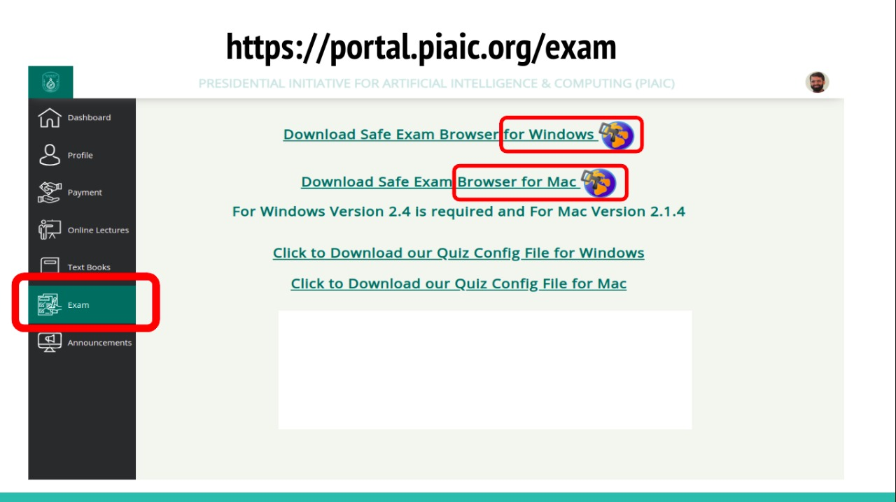
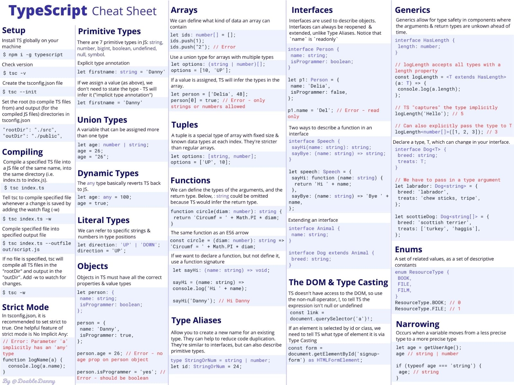

# Learn TypeScript 5.0+ in Baby Steps

### [Start from this presentation](https://docs.google.com/presentation/d/1-7Kb3laJjJ68mOTF9v0fHImk5vTol0CeE43Sg8hoUXQ/edit?usp=sharing)

### [Watch Learn TypeScript – Full Video Tutorial by freeCodeCamp.org](https://www.youtube.com/watch?v=30LWjhZzg50)

We will learn TypeScript by taking small incremental steps. 

Chapters 1-11 of [Learning TypeScript: Enhance Your Web Development Skills Using Type-Safe JavaScript](https://www.amazon.com/Learning-TypeScript-Development-Type-Safe-JavaScript/dp/1098110331/ref=sr_1_1)

[In Class Companion projects and articles for Learning TypeScript](https://www.learningtypescript.com/)

[Learning TypeScript Project Code in Class](https://github.com/LearningTypeScript/projects)

[TypeScript Cookbook: Future Advanced TypeScript Book](https://www.oreilly.com/library/view/typescript-cookbook/9781098136642/)

Note:

[TypeScript and C# both were created by the same person named Anders Hejlsberg](https://dev.to/destrodevshow/typescript-and-c-both-created-by-the-same-person-named-anders-hejlsberg-42g4)

### TypeScript Homework Coding Projects:

[TypeScript Node.js Projects](https://github.com/panacloud-modern-global-apps/typescript-node-projects)

### Learn From Matt Pocock The TypeScript Wizard

[Latest News: Matt Joins Vercel](https://twitter.com/mattpocockuk/status/1559105611995955202)

[Total TypeScript Website](https://www.totaltypescript.com/)

[TypeScript Crash Course for Beginners with Matt Pocock: Video](https://www.youtube.com/watch?v=p6dO9u0M7MQ&t=25s)

[Learning TypeScript from Scratch with Matt Pocock: A TypeScript tutorial](https://www.youtube.com/watch?v=qcFmCKQDa2s&t=1s)

[Beginner TypeScript Tutorial](https://github.com/total-typescript/beginners-typescript-tutorial)

[Zod Tutorial: Video](https://www.totaltypescript.com/tutorials/zod)

[Zod Docs](https://zod.dev/)

[Advanced TypeScript Workshop](https://github.com/total-typescript/advanced-typescript-workshop)

[Advanced TypeScript with Matt: Video](https://www.youtube.com/watch?v=F7O4gA0GXqI&t=389s)

[TypeScript Tips](https://www.totaltypescript.com/tips)

[TypeScript tips and Tricks with Matt: Video](https://www.youtube.com/watch?v=hBk4nV7q6-w&t=24s)

### TypeScript Proficiency Quiz Details and Instructions

All Web 3 and Metaverse Students who are already software developers will appear in the following Quiz remotely from home:

Name: TypeScript Proficiency Quiz

Date and Time: Sunday, Oct 23, 9:00 pm

URL: https://portal.piaic.org/

Total MCQs: 63 

Total Time: 120 minutes

Please complete your installation, etc. ASAP i.e. before the exam.

It is important to note the following:
1. You will attempt your exam at your home using the Safe Exam Browser.
2. Download & Install Safe Exam Browser from Portal.
3. After Installing the safe browser, download the Config file from the PIAIC Portal.
4. Right click on the config file and select “open with” then select SEB.
5. After running the Config file, log in with PIAIC Portal Credentials
6. Select your Quiz and enter the security key (which will be available on the portal in the exam section) & start the test.
7. Make sure you have a stable internet connection before attempting the quiz.
8. Once you have completed the quiz simply logout and close the browser, your quiz will be submitted.
9. The Quiz can only be attempted on a Laptop or a Desktop computer running Windows or Mac only.
10. If you miss the quiz date there will be strictly no re-scheduling
11. Security key for the quiz will be available on Portal in exam section
12. It is essential to note that QUIZZES WILL NOT BE RESCHEDULED FOR ANY REASON REGARDLESS OF THE CIRCUMSTANCES.

Safe Exam Browser installation and configuration Guide is available here.:

https://youtu.be/MhYvz-50y0Y

Note: Those who are beginners in programming should not appear in this quiz now, but will appear in the quiz at the end of the quarter.

### Learn Next.js and Node.js/Express

[You can also learn Next.js using TypeScript from here](https://github.com/panacloud-modern-global-apps/nextjs)

[You can also learn Node.js/Express using TypeScript from here](https://github.com/panacloud/learn-typed-express)
